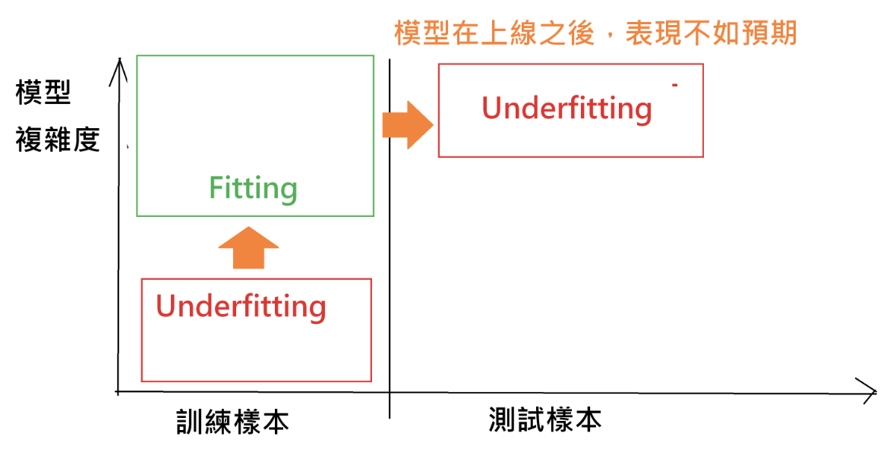
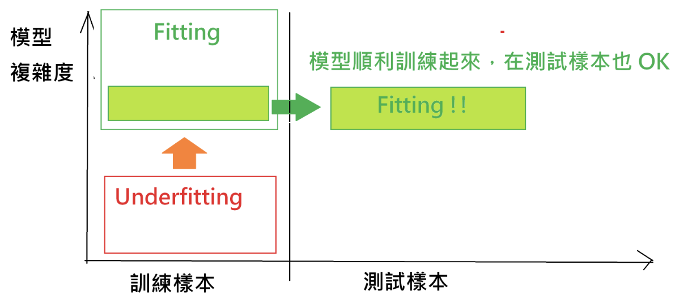

組員： `B035040052 林榮鏵` `B045020041諶彥汝` `B056090039 楊禾馨` `M064020056 閻俞蓉` `M064111003 洪筱涵` `M074111035 劉志峰`


```{r results='hide', message=FALSE, warning=FALSE, echo=FALSE}
# 這些程式碼設定網頁的格式，並安裝、載入一些基本的套件，請大家不要去改動<br>
rm(list=ls(all=T))
knitr::opts_chunk$set(comment = NA)
knitr::opts_knit$set(global.par = TRUE)
par(cex=0.8)
options(scipen=20, digits=4, width=90)
#
if(!require(pacman)) install.packages("pacman")
pacman::p_load(dplyr)
```

### <span style="font-size:22px">`r "\U1F4D6"` 學習重點：</span>  {data-height=250}
<p class="wwl">
【A】從第五周的「[有獎徵答](https://gtonychuo.github.io/2019RPB/unit05/quiz05.html)」我們學到使用`頻率`、`密度`和`機率`來表示`隨機變數`的`分布`<br>
&emsp;■ 分布：變數的值所出現的頻率<br>
&emsp;■ 連續變數的分布有三種表達方式：次數(頻率)、密度、機率<br>
&emsp;■ `連續變數`和`離散變數`的分布的表達方式是不一樣的<br>
<br>
【B】從這一份練習，我們學到：<br>
&emsp;■ 平均值、標準差等`統計量`可以表達隨機變數的概況，但它們無法完整表示隨機變數的分布<br>
&emsp;■ 透過`圖形`或`數學函數`，我們才能清楚地表示和運算(估計、預測)隨機變數的分布<br>
&emsp;■ `模型`：將現實抽象化(Abstract of Reality)，使其好懂(好溝通)或好計算<br>
&emsp;■ 圖形和數學函數都可以用來表示隨機變數的分布，前者好懂，後者方便運算<br>
&emsp;■ `數值標記`、`直方圖`和`平滑密度曲線`都可以寫成`機率密度函數(PDF)`<br>
&emsp;■ 數值標記和直方圖的函數形式比較複雜，也容易有量化誤差<br>
&emsp;■ 因此平滑密度曲線通常比較適合用來表示連續變數的分布<br>
&emsp;■ 機率密度函數(PDF)積分之後就可以得到`累計機率函數(CDF)`，前者好懂，後者好算<br>
<br>
【C】資料、模型、方法、參數：<br>
&emsp;■ 透過調整`方法參數`，同一份資料用同一種`方法`可以做出不同的`模型`<br>
&emsp;■ 通常模型越複雜，它跟訓練資料之間的誤差就越小<br>
&emsp;■ 但是模型太複雜就會失去一般性，反而不能夠準確的估計訓練資料以外的對象<br>
&emsp;■ 所以我們需要用方法參數來控制分析方法的複雜度，避免`過度適配`(`over fitting`)<br>
<br>
【D】估計機率的程序：<br>
&emsp;■ 選擇分析方法<br>
&emsp;■ 藉由調整方法參數盡量找出最適(PDF)模型<br>
&emsp;■ 透過積分，從PDF求出CDF<br>
&emsp;■ 根據變數的範圍，從CDF求出機率<br>
<br>
</p class="wwl">


### <span style="font-size:22px">`r "\U1F4E2"` 問題討論：</span>  {data-height=250}
<p class="qiz">
【A.選擇方法】<br>
&emsp;■ 我們為甚麼需要隨機變數？ 什麼時候我們需要用到隨機變數？<br>
&emsp;<font color=steelblue> 
隨機變數是一個不確定性事件結果的數值函數，把不確定性事件的結果用數值來表示。<br>
&emsp;當需要很大的樣本空間，或是要預測未來結果，或是沒有辦法取得正確數值的時候，需要使用隨機變數。</font><br>
&emsp;■ 隨機變數沒有固定的值，那我們要如何做計算呢？<br>
&emsp;<font color=steelblue> 透過隨機變數相關統計量來進行計算，平均值、標準差等都可以表達隨機變數的概況，<br>
&emsp;在R可以使用sample()，runif()，rnorm()等函數。 </font><br>
&emsp;■ 我們可以用直方圖或數值標記來估計噴發時間落在某一區間的機率嗎？<br>
&emsp;<font color=steelblue> 可以，透過rug函數，計算資料中的數值並標記在x軸上（噴發時間），之後再積分，把積分曲線圖畫出來。 <br></font>
```
#eruptions 噴發時間與機率次數關係圖
par(cex=0.7)
plot(0,0,xlim=c(1.5,5.25),ylim =c(0.0,1.05),xlab="噴發時間(分鐘)",ylab="密度",main="分佈,機率與密度")
abline(h=1, col='darkgray', lwd=0.2, lty=2)

#PDF（經驗觀察）
rug(eruptions)

#CDF（經驗觀察）
plot(ecdf(eruptions),cex=0,verticals = T,lwd=0.2,col="darkgray",add=T)
#ecdf是CDF經驗觀察的趨勢線，cex是趨勢線的明顯度，add=T 是指把圖重疊起來

#PDF（質量密度=直方圖）
Bins=20#直方圖條狀的數量
bs=seq(min(eruptions),max(eruptions),length=Bins+1)
hist(eruptions,col="#B3FFFF7F",border="white",   #col是hist顏色，border是hist的白色邊線
     breaks = bs,freq = F,add=T)  #break是區間數量（長條的分佈），頻率設為F，add=T 則是疊圖
abline(h=0,col="darkgray",lwd=0.2,lty=2)
```

&emsp;■ 直方圖(histogram)也可以當作一種模型嗎？ 數值標記(rug)呢？<br>
&emsp;<font color=steelblue> 直方圖可以透過binwidth的寬度，大概看得出資料的分佈情形，數值標記則是透過積分把資料分佈較為精準的畫出來。 數值標記要在原本的code加上add=T。<br></font>
```
if(input$rug) rug(D)
  if(input$hist) hist(
    D,freq=F,col="#B3FFFF",border="white",
    ylim=c(0,1.1),add=T,breaks=bx)
```
&emsp;■ 直方圖和平滑模型哪一個比較適合用來表示噴發時間的分布？ 為甚麼？<br>
&emsp;<font color=steelblue> 平滑模型，因為噴發時間屬於連續變數，相較於直方圖不易有量化誤差，適合表示連續變數的分布。</font><br>
&emsp;■ 用數值標記來預測噴發時間會比用直方圖「準」嗎？ 「準」是什麼意思呢？<br>
&emsp;<font color=steelblue> 數值標記比直方圖更準(更接近數據)！因為數值標記是透過資料所提供的數據進行複雜的積分得出的預測值，而直方圖則是把數據存入通過欄寬的調整觀察出大概的機率分佈。因此，數值標記相對於直方圖的數據誤差，來得更小。<br>
&emsp;而這裡說的「準」，是指預測未來或之後要預測別的模型的時候，是準確的意思。 <br>
</font><br>
<br>

【B.調整參數】調整一下模型參數的滑桿 ...<br>
&emsp;■ 你覺得最合適的直方圖欄數(`support/binwidth`)是？ 為甚麼？<br>
&emsp;<font color=steelblue> 18，因為凸顯的比較有次序，不會凹凸不平。 </font><br>
&emsp;■ 最合適的平滑模型頻寬(`bandwidth`)呢？<br>
&emsp;<font color=steelblue> 0.5，使用平滑模型累計機率函數貼近數值標記，之後做 平滑密度函數曲線的調整，越小自然更接近數據值，但曲線會看起來較為陡峭而過適而造成誤差。 </font><br>
&emsp;■ 調高欄寬和頻寬會讓模型變複雜，還是變簡單呢？<br>
&emsp;<font color=steelblue> 調高欄寬(bandwidth)變複雜，直方圖會呈現超出預設範圍與高低呈現不規律，<br>
調高平寬(binwidth)變簡單，平滑模型累計機率函數因乏適應(Underfitting)而呈現平緩與數據值相差甚遠。 </font><br>
&emsp;■ 模型越複雜，它跟實際值之間的誤差是越大、還是越小？<br>
&emsp;<font color=steelblue> 直方模型複雜時，誤差大，直方圖會呈顯凹凸的次序而影響到我們的觀察。<br> 平滑模型複雜時，誤差大，因為過於接近數據值而產生過適（overfitting）的情況，但卻與實際狀況卻差很多。</font><br>
&emsp;■ 那麼，越複雜的模型就會越準，對嗎？<br>
&emsp;<font color=steelblue> 不對，越複雜的模型會overfit，在training data準但是在test data不一定會準。 </font><br>
<br><br>

&emsp;<font color=steelblue>最美好的情況，就是要在訓練樣本與測試樣本中間找到一個最佳的模型複雜度區間，在這個區間的模型複雜度能在訓練樣本訓練的起來，在測試樣本也很成功的使用：</font>
<br><br>

<br>
【C.建立模型、估計機率】<br>
請從課堂筆記的程式碼找出來 ... <br>
&emsp;■ 從變數向量(`D`)求出機率密度曲線(`DEN`)<br>
```
D = faithful$eruptions
DEN = density(D, adjust = 1)
```
&emsp;■ 將機率密度曲線(`DEN`)轉換成機率密度函數(`PDF`)<br>
```
PDF = approxfun(DEN$x, DEN$y, yleft=0, yright=0)
```
&emsp;■ 對機率密度函數(`PDF`)做積分，算出機率(`PROB`)<br>
```
PROB = integrate(PDF, input$R[1], input$R[2])$value
gauge(round(100*PROB), min = 0, max = 100, symbol = '%', gaugeSectors(
      success = c(41, 100), warning = c(21, 40), danger = c(0, 20)) )
```
<br>
這三行程式，然後...<font color=steelblue>將faithful`$`eruptions改成faithful`$`waiting</font><br>
&emsp;■ 將頻寬調整參數(`adjust`)設為`1`，算出「等待時間」落在80到90之間的機率<br>
```{r}
W = faithful$waiting
DEN = density(W, adjust = 1)
PDF = approxfun(DEN$x, DEN$y, yleft=0, yright=0)
PROB = integrate(PDF, 80, 90)$value
#install.packages("flexdashboard")
library(flexdashboard)
gauge(round(100*PROB,2), min = 0, max = 100, symbol = '%', gaugeSectors(
      success = c(41, 100), warning = c(21, 40), danger = c(0, 20)) )
PROB
```

&emsp;■ 將頻寬調整參數設為`0.5`，算出等待時間落在80到90之間的機率<br>
```{r}
DEN = density(W, adjust = 0.5)
PDF = approxfun(DEN$x, DEN$y, yleft=0, yright=0)
PROB = integrate(PDF, 80, 90)$value
gauge(round(100*PROB,2), min = 0, max = 100, symbol = '%', gaugeSectors(
      success = c(41, 100), warning = c(21, 40), danger = c(0, 20)) )
PROB
```

&emsp;■ 算出來的機率比較高的就是比較好的模型，對嗎？ 為甚麼？<br>
&emsp;<font color=steelblue> 不一定，模型機率高只是對原始數據準確(overfitting)，但對預測數據會不準。</font><br>
<br><br>


`r "\U1F4B5"``r "\U1F4B6"``r "\U1F4B7"``r "\U1F4B8"`【D.預測與決策】`r "\U1F4B5"``r "\U1F4B6"``r "\U1F4B7"``r "\U1F4B8"`<br>
假設有一個賭局，你可以花30元選定一個連續60秒的時段，如果老忠實下一次的噴發時間落在你指定的區間，你就可以贏到100元；請你使用頻寬為`0.5`的平滑密度模型 ...<br>
&emsp;■ 決定要不要參加這個賭局<br>
&emsp;<font color=steelblue> 要參加，以試驗10000000次下，每一局平均可以獲得18元 </font><br>

```{r}
#利用rbinom 計算：
bet=10000000
x=rbinom(bet,1,0.48)#隨機計算：賭100次，機率為0.48
a=sum(x==1)#贏的次數
b=bet*30#賭的費用：每一局30元，賭100局
c=a*100#賭贏的錢（贏得100元）
d=c-b#賺到的錢
d/bet#期望值
```

&emsp;■ 如果你參加的話，你要把噴發時間設定在哪一個區間呢？<br>
&emsp;<font color=steelblue> 直接調模型的數值範圍，找到在3.9-4.9有最大的機率47.66%</font><br>
```{r}
#用R算機率
D=faithful$eruptions
DEN = density(D, adjust = 0.5)
PDF = approxfun(DEN$x, DEN$y, yleft=0, yright=0)
prob=integrate(PDF, 3.9, 4.9)$value
prob
gauge(round(100*prob,2), min = 0, max = 100, symbol = '%', gaugeSectors(
      success = c(41, 100), warning = c(21, 40), danger = c(0, 20)) )
```

&emsp;■ 你設在這個區間的話，參加這個賭局的期望值是？<br>
```{r}
(100-30)*prob + (-30)*(1-prob)
```
&emsp;<font color=steelblue> 期望值為17.66，即，你贏得的錢（100元扣除30元本金的押注)`*`贏錢機率0.4766與損失的金額（-30元）`*`輸錢機率（1-0.4766）兩者總和</font><br>
<br>
假如賭場老闆從零開始把每10秒鐘設為一個區間，每個區間的賭金是五塊錢 ...<br>
&emsp;■ 你要怎麼押注，才能獲得最高的期望值呢？<br>

```{r}
time=seq(1,6-1/6,1/6) #將1-6分鐘，每10秒鐘切段
prob=sapply(time,function(time){
  prob=integrate(PDF, time, time+1/6)$value
  }) #每區間會噴發的機率
exp=prob*95 + (1-prob)*(-5) #每區間的期望值
time #每10秒鐘為間隔
prob#每個區間的機率
exp #在每一個間隔內的期望值，正數會賺錢！
TPE=data.frame(time,prob,exp)
```
```{r}
tail(sort(tapply(TPE$exp,TPE$time,max)),9)
```

&emsp;<font color=steelblue> 一共<font color=VioletRed>9個區間會賺錢</font><br>
&emsp;期望值 / 時間區間<br>
&emsp;1) 0.8341 / 3.833-4.000<br>
&emsp;2) 1.3667 / 1.667-1.833<br>
&emsp;3) 1.8426 / 4.667-4.833<br>
&emsp;4) 1.9676 / 2.000-2.167<br>
&emsp;5) 2.6535 / 4.000-4.167<br>
&emsp;6) 3.2257 / 1.833-2.000<br>
&emsp;7) 3.9323 / 4.167-4.333<br>
&emsp;8) 3.9384 / 4.500-4.667<br>
&emsp;9) 4.5766 / 4.333-4.500<br>
</font><br>

&emsp;■ 你的賭金和期望值各是多少？<br>
&emsp;<font color=steelblue>若賭金一共30元，分為5元一個時間區間，一共可以選6個區間，<br>
&emsp;<font color=VioletRed>30元</font>分散投資購買以下6個時間區間，期望值一共是<font color=VioletRed>20.29元</font>。<br>
&emsp;期望值/ 時間區間 <br>
&emsp;1) 1.9676 / 2.000-2.167<br>
&emsp;2) 2.6535 / 4.000-4.167<br>
&emsp;3) 3.2257 / 1.833-2.000<br>
&emsp;4) 3.9323 / 4.167-4.333<br>
&emsp;5) 3.9384 / 4.500-4.667<br>
&emsp;6) 4.5766 / 4.333-4.500<br></font>


```
#9個正的期望值（大於0）
[1] 0.8341262 1.3667726 1.8426544 1.9676356 2.6535707 3.2257590 3.9323979 3.9384459 4.5766065
```
```
sum(tail(expa,6))#找出最大的6個期望值並加總
[1] 20.29442
```


```{r results='hide', message=FALSE, warning=FALSE, echo=FALSE}
time=seq(1,6,1/6) #將1-6分鐘，每10秒鐘切段
#迴圈
for(i in time){
  prob=sapply(i,function(i){
    prob = integrate(PDF,i,i+1)$value
  })
}
exp=prob*95 + (1-prob)*(-5) #每區間的期望值
time #每10秒鐘為間隔
prob #每個區間的機率
exp #在每一個間隔內的期望值，正數會賺錢！
```


<br>
將獲利的期望值和賭金的比值稱為「期望投資報酬率」 ...<br>
&emsp;■ 「最大期望投資報酬率」和「最大期望報酬」的投資策略是一樣的嗎？<br>
&emsp;<font color=steelblue> 若假設30元分為5元選6個區間作為最大期望投資報酬率，30元選一個區間為最大期望報酬率 ，而兩者投資策略是不一樣的。 </font><br>
&emsp;■ 你認為哪一個策略目標比較好呢？ 為什麼？<br>
&emsp;<font color=steelblue> 30元分為6個區間作為最大期望報酬率的策略目標稍微好一些，因為投資報酬率的期望值較大一些（20.29 > 18 ），策略目標主要趨利避害的方式進行投資，把賭金的效能最大化，所謂：<font color=VioletRed>“作業交出去，分數進得來，蠢材變天才。”  </font></font><br>
<br>
</p class="qiz">
<br><br><br><br><br>

